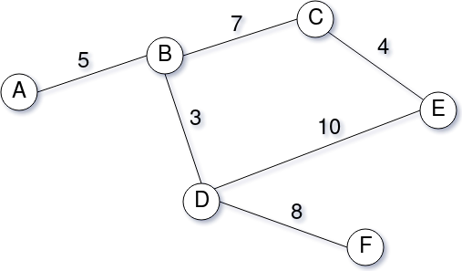

# Processo Seletivo Vagas - Engenheiro de Software

## Recrutando candidatos

Um recrutador precisa analisar as candidaturas recebidas para vagas de emprego. Dado o grande volume de candidaturas em algumas vagas, olhar um-a-um seria um trabalho muito demorado.

Seu papel aqui é ajudar o recrutador, indicando as pessoas mais aderentes para cada vaga. Para isso, crie uma API de acordo com as especificações a seguir.

### Especificações da API

Considerações gerais:

* **Níveis de experiência**:
  * **1**: estagiário
  * **2**: júnior
  * **3**: pleno
  * **4**: sênior
  * **5**: especialista
* **Localidades**: representadas por letras do alfabeto. Verificar no mapa abaixo os caminhos e distâncias entre as localidades.



##### Cálculo do score:

$$ SCORE = N + 3 \times D$$, onde:

* $$N =  100 - 25 \times |n_v - n_c|$$, onde:
  * $n_v$ é o nível da vaga
  * $$n_c$$ é o nível do candidato
* $$D = \dfrac{1}{d_{menor}} \times 100$$, onde $$d_{menor}$$:
  * $$1$$, se a vaga e o candidato estão na mesma localidade
  * ***Menor distância entre o candidato e a vaga***, caso contrário


Considere somente a parte inteira do *SCORE*.

*_Esperamos que você implemente o algoritmo para o cálculo de distância. **Não é permitido a utilização de bibliotecas para a realização desta tarefa**._

*_Ressaltando que esta é uma fórmula hipotética_


#### 1. Criar um endpoint para cadastrar vagas de emprego

**Request:** 

```POST http://localhost:9000/v1/vagas```

+ Body:

```json
{
    "empresa": "Teste",
    "titulo": "Vaga teste",
    "descricao": "Criar os mais diferentes tipos de teste",
    "localizacao": "A",
    "nivel": 3
}
```

**Response:**

O response para esta função será definido por você e **faz parte da avaliação**.

#### 2. Criar um endpoint para cadastrar pessoas

**Request:** 

```POST http://localhost:9000/v1/pessoas```

+ Body:

```json
{
    "nome": "John Doe",
    "profissao": "Engenheiro de Software",
    "localizacao": "C",
    "nivel": 2
}
```

**Response:**

O response para esta função será definido por você e **faz parte da avaliação**.

#### 3. Registrar candidatura de uma pessoa em uma vaga

Neste endpoint você deverá registar a candidatura do candidato para a vaga em questão.

**Request:** 

```POST http://localhost:9000/v1/candidaturas```

+ Body:

```json
{
    "id_vaga": 1,
    "id_pessoa": 2
}
```

**Response:**

O response para esta função será definido por você e **faz parte da avaliação**.

#### 4. Criar um endpoint para retornar os candidatos de uma vaga, ordenados pelo score (de forma decrescente)

**GET:** `http://localhost:9000/v1/vagas/1/candidaturas/ranking`

**Response:**

```json
[
    {
        "nome": "Mary Jane",
        "profissao": "Engenheira de Software",
        "localizacao": "A",
        "nivel": 4,
        "score": 375
	},
    {
        "nome": "John Doe",
        "profissao": "Engenheiro de Software",
        "localizacao": "C",
        "nivel": 2,
        "score": 100
	},
    ...
]
```

